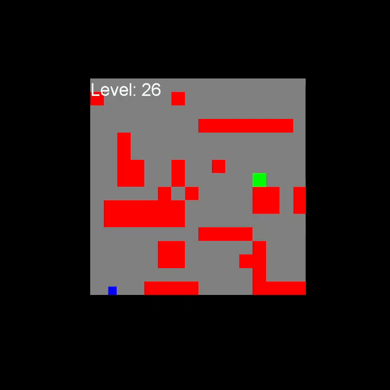

# Platformer-Without-Platform
A Platformer Without Platforms.

# Description
This project, A Platformer Without Platforms, is a 2D platformer. However, unlike traditional platformers, there are no platforms for the player to rest on. I programmed this game because I wanted to explore something new and fun to play, and taking a platformer to the extreme counts:
-	In this new style of game, there are no platforms to rest on, so the player (blue square) has to react faster.
-	The shape and position of obstacles (red rectangles) and the goal (green square) is random, bringing more fun and challenge to the game.
-	To compensate for the lack of platforms, the player gets to choose movement upgrades. This lets them explore how different sets of abilities work.

## Background

This platformer was originally created as a **Java** program in **CodeHS** however has now been transferred to use the **JAR file** framework. This engine's intended use now is to be a JAR application.

## Project Prerequisites

To be able to run this project you will need to install the Java Swing library if it hasn't been installed already.

## Run App
    
    git clone https://github.com/ezhong08/Platformer-Without-Platform.git

    javac -d out Main.java

    cd out
    java Main

## How to play

Use the following keyboard controls to play the game:

- **Main Menu Options**
  - **B** : Go Back
  - **D** : Basic Instructions
  - **P** : Play
- **Arrow Keys**
  - `↑` : Tilt Up
  - `↓` : Tilt Down
  - `←` : Move Left
  - `→` : Move Right
- **Z** : Jump
- **X** : Special Action
- **C** : Passive Boost
- **Space** : Dash
- **R** : Generate New Level

The objective is to move the player character to the goal of each level. The levels get progressively harder as more and more obstacles will exist in each level.

Every 2 levels, an upgrade will be available. Many upgrades are on "upgrade branches" that require you to get all of the previous upgrades in the branch first before getting it.

# Gameplay

